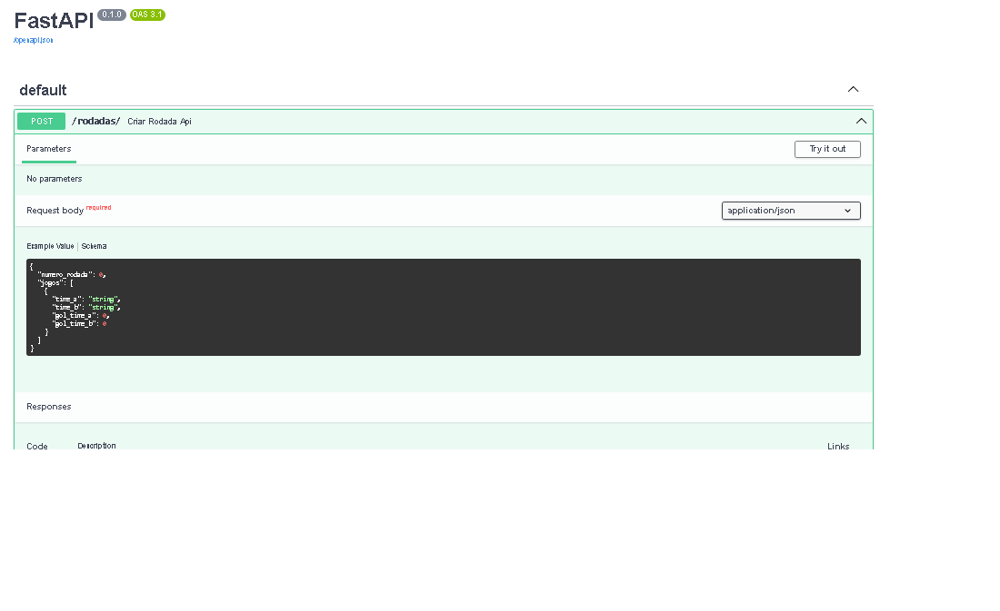
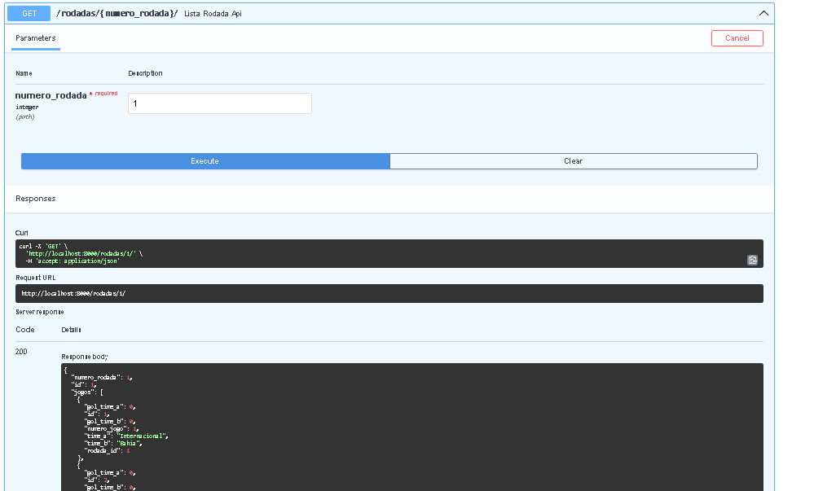

# API Campeonato Brasileiro 2024 Python

Este é um projeto de exemplo para demonstrar como criar uma aplicação web usando FastAPI, SQLAlchemy e MySQL para gerenciar um campeonato brasileiro de futebol.

## Requisitos

- Python 3.7 ou superior
- Ambiente virtual (recomendado)
- MySQL
- Crie um banco de dados chamado cpbr24, sendo a senha root e usuario root(também pode ficar a seu criterio  só  que  precisa alterar as informações no arquivo de database.py)

## Instalação

1. Baixe o repositório o git:

     ``git clone https://github.com/seu-usuario/campeonato-brasileiro-python.git`` 

##

2. Crie e ative o ambiente virtual:
    `` python -m venv venv ``
     
    - No Windows:
        `` venv\Scripts\activate ``
         
    - No Linux/gitbash/macOS:
        `` source venv/bin/activate ``
 
3. Instale as dependências do projeto:
    `` pip install -r requirements.txt ``

## Executando o servidor

 1.Para iniciar o servidor, execute o seguinte comando:
     `` python main.py ``

Isso iniciará o servidor FastAPI na porta 8000. Você pode acessar a documentação da API em http://localhost:8000/docs.

## Estrutura  do projeto 

    main.py: Arquivo principal que inicia o servidor FastAPI.
    repository/database.py: Configuração do banco de dados e funções para inicializá-lo.
    routes/routes.py: Define as rotas da API usando FastAPI.
    service/crud.py: Define  o serviço de regras de negocio e cada logica(funcionalidade) que  a api ira realizar.
    models/models.py: Define os modelos de dados usando SQLAlchemy.
    schemas/schemas.py: Define os esquemas de dados usando Pydantic.

## Exemplo de uso 

### POST

Cadastra os times daquela rodada exemplo  rodada 1 , Observação  mesmo o valor de gols , no cadastro é sempre 0 ,  pois o valor da rodada

``
    {
    "numero_rodada": 1,
    "jogos": [
        {
            "time_a": "Internacional",
            "time_b": "Bahia",
            "gol_time_a": 2,
            "gol_time_b": 1
        },
        {
            "time_a": "Criciuma",
            "time_b": "Juventude",
            "gol_time_a": 1,
            "gol_time_b": 1
        },
        {
            "time_a": "Fluminense",
            "time_b": "Bragantino",
            "gol_time_a": 2,
            "gol_time_b": 2
        },
        {
            "time_a": "Sao Paulo",
            "time_b": "Fortaleza",
            "gol_time_a": 1,
            "gol_time_b": 2
        },
        {
            "time_a": "Vasco",
            "time_b": "Gremio",
            "gol_time_a": 0,
            "gol_time_b": 0
        },
        {
            "time_a": "Corinthians",
            "time_b": "Atletico-MG",
            "gol_time_a": 0,
            "gol_time_b": 0
        },
        {
            "time_a": "Athletico-PR",
            "time_b": "Cuiaba",
            "gol_time_a": 0,
            "gol_time_b": 0
        },
        {
            "time_a": "Atletico-GO",
            "time_b": "Flamengo",
            "gol_time_a": 0,
            "gol_time_b": 0
        },
        {
            "time_a": "Cruzeiro",
            "time_b": "Botafogo",
            "gol_time_a": 0,
            "gol_time_b": 0
        },
        {
            "time_a": "Vitoria",
            "time_b": "Palmeiras",
            "gol_time_a": 0,
            "gol_time_b": 0
        }
    ]
}
``

### GET

Você inclui informa o numero da rodada,  retorna os jogos vinculados a mesma

